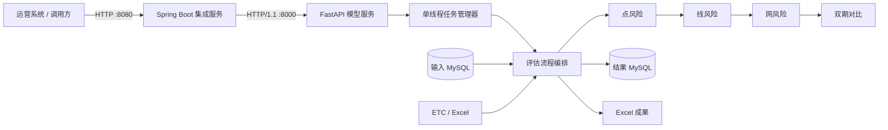

# Highway Risk Assessment

重庆山区高速公路路网安全运营综合评价系统，基于结构物、交通流、气象、交通事故与路网拓扑等多源数据，实现“点—线—网”三级通行风险评估、双月周期对比和结果持久化。


> 本项目为校企合作项目的工程实现。仓库不包含企业业务数据、数据库密码、运行日志及生产环境配置。

## 项目介绍

系统将原有 Python 风险评估模型封装为可集成的异步任务服务：FastAPI 负责任务提交和状态管理，Spring Boot 负责对外提供稳定的业务接口，Docker Compose 负责统一构建与部署。调用方无需感知 Excel、MySQL 和各级模型的内部处理细节。

项目已将一次双月数据分析全流程从约 40 分钟优化至约 20 分钟，并在企业生产环境持续运行 8 个月。

## 核心功能

| 功能          | 说明                                                   | 主要输出                             |
| ------------- | ------------------------------------------------------ | ------------------------------------ |
| 多源数据准备  | 合并 ETC 原始数据，从 MySQL 导出气象预警和交通事故数据 | CSV、JSON、Excel                     |
| 点风险评估    | 评估桥梁、隧道、边坡等结构物风险                       | `point_*` 数据表、点风险 Excel       |
| 线风险评估    | 综合结构物、交通、气象、事故和道路属性评估路段风险     | `line_risk_evaluation`、线风险 Excel |
| 网风险评估    | 从路段风险、连通性、路网密度和运行状态评估路网风险     | `net_risk_evaluation`、网风险 Excel  |
| 双期风险对比  | 识别风险上升、本期高风险和持续高风险对象               | `risk_contrast`、对比 Excel          |
| 异步 REST API | 提交评估任务，通过任务 ID 轮询阶段、结果或错误         | JSON                                 |
| Java 业务集成 | Spring Boot 通过 HTTP/1.1 调用 Python 模型服务         | `/api/risk-assessments`              |
| 容器化部署    | 统一构建、健康检查、服务依赖和目录挂载                 | Docker Compose                       |

## 技术架构



完整任务的执行阶段为：

```text
CONFIG_UPDATE (可选)
  → INPUT_PREPARATION (可选)
  → RISK_ASSESSMENT [Point → Line → Network] (可选)
  → PERIOD_COMPARISON (可选)
  → COLLECTING_ARTIFACTS
  → COMPLETED / FAILED
```

## 技术栈

| 层次           | 技术                                                  | 用途                                      |
| -------------- | ----------------------------------------------------- | ----------------------------------------- |
| 模型与数据处理 | Python 3.12、Pandas、NumPy、OpenPyXL、python-calamine | 数据清洗、多源融合、风险计算和 Excel 读写 |
| 数据库         | MySQL、PyMySQL                                        | 源数据读取、配置同步和结果持久化          |
| 模型服务       | FastAPI、Pydantic、Uvicorn                            | 请求校验、任务提交和状态查询              |
| 业务集成       | Java 17、Spring Boot 3.4.4、Actuator                  | 调用 Python API，统一对外接口和异常转换   |
| 工程交付       | Docker、Docker Compose、Maven、Git                    | 构建、测试、服务编排和部署                |

## 快速开始：Docker Compose

### 1. 环境要求

- Docker Engine 24+ 或 Docker Desktop
- Docker Compose v2
- 可访问的 MySQL 数据库
- 已准备的 ETC 原始 Excel 及模型所需基础数据

### 2. 获取项目

```bash
git clone https://github.com/Noneny/Highway_Risk_Assessment.git
cd Highway_Risk_Assessment
```

### 3. 配置运行参数

```bash
cp .env.example .env
```

编辑 `.env`，至少配置评估周期、输入库、结果库和 ETC 数据目录：

```dotenv
RISK_BELONG_DATE=2025-12-01

RISK_INPUT_DB_HOST=host.docker.internal
RISK_INPUT_DB_PORT=3306
RISK_INPUT_DB_USER=risk_user
RISK_INPUT_DB_PASSWORD=change-me
RISK_INPUT_DB_NAME=freeway_risk_input

RISK_OUTPUT_DB_ENABLE=true
RISK_OUTPUT_DB_AUTO_CREATE=false
RISK_OUTPUT_DB_HOST=host.docker.internal
RISK_OUTPUT_DB_PORT=3306
RISK_OUTPUT_DB_USER=risk_user
RISK_OUTPUT_DB_PASSWORD=change-me
RISK_OUTPUT_DB_NAME=freeway_risk_output

ETC_DATA_DIR=./data/etc
```

`host.docker.internal` 表示容器访问宿主机上的 MySQL。如果 MySQL 位于其他服务器，请改为对应 IP 或域名。启用 `update_config=true` 时，还需填写 `RISK_CONFIG_DB_*` 参数。

> 请勿将包含真实密码的 `.env`、`config/input_db.ini` 或 `config/output_db.ini` 提交到 Git。

### 4. 准备挂载目录

```text
config/       模型参数和映射配置
data/input/   模型基础输入
data/temp/    中间计算文件
data/output/  最终 Excel 成果
log/          运行日志
ETC_DATA_DIR  ETC 原始 Excel 目录（只读挂载）
```

`data/` 中的业务数据已被 Git 忽略，首次运行前需按实际评估周期准备。详细文件要求见[技术文档](技术文档.md)。

### 5. 构建并启动

```bash
docker compose up -d --build
docker compose ps
```

服务启动后：

- FastAPI Swagger UI：<http://localhost:8000/docs>
- FastAPI 健康检查：<http://localhost:8000/health>
- Spring Boot 健康检查：<http://localhost:8080/actuator/health>

```bash
curl http://localhost:8000/health
curl http://localhost:8080/actuator/health
```

## 完整调用流程

### 1. 提交评估任务

推荐通过 Spring Boot 集成服务调用：

```bash
curl -X POST "http://localhost:8080/api/risk-assessments" \
  -H "Content-Type: application/json" \
  -d '{
    "prepare_input": true,
    "update_config": false,
    "compare": true,
    "recalculate": true
  }'
```

接口返回 HTTP `202 Accepted`：

```json
{
  "task_id": "087b1a6a-6a13-45d8-a647-c583f784b153",
  "status": "QUEUED",
  "phase": "QUEUED",
  "created_at": "2026-08-11T08:00:00+00:00",
  "started_at": null,
  "finished_at": null,
  "result": null,
  "error": null
}
```

### 2. 轮询任务状态

```bash
curl "http://localhost:8080/api/risk-assessments/087b1a6a-6a13-45d8-a647-c583f784b153"
```

`status` 可能为 `QUEUED`、`RUNNING`、`SUCCEEDED` 或 `FAILED`。成功时，`result.artifacts` 会返回本次任务产生或更新的成果文件：

```json
{
  "status": "SUCCEEDED",
  "phase": "COMPLETED",
  "result": {
    "elapsed_seconds": 1188.431,
    "artifacts": [
      {
        "kind": "POINT_RISK",
        "path": "data/output/全结构点通行风险值评价表.xlsx",
        "size_bytes": 1258291,
        "modified_at": "2026-08-11T08:20:00+00:00"
      }
    ]
  }
}
```

任务失败时，`status` 为 `FAILED`，`phase` 为 `FAILED`，具体原因位于 `error` 字段。

### 3. 查看结果

- Excel 文件：`data/output/`
- MySQL 结果表：`point_alert_statistic`、`point_etc_traffic_evaluation`、`point_risk_evaluation`、`line_risk_evaluation`、`net_risk_evaluation`、`risk_contrast`
- 运行日志：`log/`

## API 概览

| 服务        | 方法   | 路径                             | 说明                       |
| ----------- | ------ | -------------------------------- | -------------------------- |
| FastAPI     | `GET`  | `/health`                        | 返回服务状态与当前忙碌状态 |
| FastAPI     | `POST` | `/api/v1/assessments`            | 提交评估任务               |
| FastAPI     | `GET`  | `/api/v1/assessments/{task_id}`  | 查询评估任务               |
| Spring Boot | `POST` | `/api/risk-assessments`          | 代理提交评估任务           |
| Spring Boot | `GET`  | `/api/risk-assessments/{taskId}` | 代理查询评估任务           |
| Spring Boot | `GET`  | `/actuator/health`               | Java 服务健康检查          |

### 请求参数

| 字段            | 类型    | 默认值  | 说明                               |
| --------------- | ------- | ------- | ---------------------------------- |
| `prepare_input` | boolean | `true`  | 执行 ETC 合并与 MySQL 输入数据导出 |
| `update_config` | boolean | `false` | 先从配置数据库同步 INI 配置        |
| `compare`       | boolean | `false` | 执行相邻双月周期风险对比           |
| `recalculate`   | boolean | `true`  | 重新执行点、线、网评估             |

`recalculate=false` 时必须同时设置 `compare=true`。

常用组合：

| 场景                 | 参数                                                   |
| -------------------- | ------------------------------------------------------ |
| 完整评估             | `prepare_input=true, recalculate=true`                 |
| 使用已有输入重新评估 | `prepare_input=false, recalculate=true`                |
| 完整评估并执行对比   | `prepare_input=true, recalculate=true, compare=true`   |
| 仅用已有结果进行对比 | `prepare_input=false, recalculate=false, compare=true` |

## 本地开发

### Python 模型与 FastAPI

```bash
python3 -m venv .venv
source .venv/bin/activate
pip install -r requirements.txt

cp config/input_db.example.ini config/input_db.ini
cp config/output_db.example.ini config/output_db.ini
# 编辑两个 ini 文件，填写本地数据库连接

uvicorn src.api.app:app --host 0.0.0.0 --port 8000 --workers 1
```

> Uvicorn 必须保持单 worker。当前任务状态保存在进程内，同时评估流程会读写共享中间文件。

也可直接执行命令行流程：

```bash
python main.py                         # 数据准备 + 点/线/网评估
python main.py --config-update         # 同步配置后评估
python main.py --compare               # 完整评估 + 双期对比
python main.py --no-input              # 使用已有输入评估
python main.py --compare --no-recalculate  # 仅执行对比
```

### Spring Boot 集成服务

```bash
cd java-service
mvn test
mvn spring-boot:run
```

Java 服务默认调用 `http://localhost:8000`，可通过环境变量修改：

```bash
export RISK_API_BASE_URL=http://localhost:8000
export RISK_API_CONNECT_TIMEOUT=5s
export RISK_API_READ_TIMEOUT=30s
```

## 测试

Python 核心回归测试：

```bash
python -m unittest \
  tests.api_tests.test_api \
  tests.api_tests.test_task_manager \
  tests.point_tests.test_database_contract \
  tests.compare_tests.test_database_insert
```

Java 测试：

```bash
cd java-service
mvn test
```

## 项目结构

```text
Highway_Risk_Assessment/
├── main.py                       # Python 命令行入口
├── requirements.txt              # Python 依赖
├── Dockerfile                    # FastAPI 模型服务镜像
├── compose.yml                   # Python + Java 服务编排
├── config/                       # 模型参数与数据库配置模板
├── data/                         # 输入、中间文件与输出（Git 忽略）
├── src/
│   ├── input/                   # 数据准备
│   ├── config_update/           # 数据库配置同步
│   ├── point_risk/              # 点风险评估
│   ├── line_risk/               # 线风险评估
│   ├── net_risk/                # 网风险评估
│   ├── compare/                 # 双期结果对比
│   ├── application/             # 评估流程编排
│   ├── api/                     # FastAPI 和任务管理
│   └── log_create/              # 日志管理
├── java-service/                  # Spring Boot 业务集成层
├── tests/                         # Python 测试
├── 接口与部署说明.md             # 快速部署参考
└── 技术文档.md                   # 完整技术文档
```

## 运行限制

- 评估任务串行执行，以避免并发修改共享输入和中间文件。
- FastAPI 任务状态保存在内存中，服务重启后历史任务不可查询。
- 任务管理器最多保留 100 条历史记录，且必须使用单 Uvicorn worker。
- API 目前未集成鉴权与访问限流，生产环境建议在反向代理或网关层实施。
- `risk_contrast` 入库时会跳过唯一键冲突的重复记录，其他记录继续写入。

## 常见问题

<details>
<summary>POST 请求返回 <code>Field required</code> 或提示请求体缺失</summary>


确认请求使用 `POST`，包含 `Content-Type: application/json`，并完整传入 `-d` 后的 JSON。Bash 可直接使用本 README 中的 `curl` 示例；Windows PowerShell 建议使用 `Invoke-RestMethod` 或正确转义引号。

</details>

<details>
<summary>容器无法连接宿主机 MySQL</summary>


确认 `.env` 中的主机为 `host.docker.internal`，MySQL 已监听可被容器访问的地址，数据库用户已授权容器网段，且防火墙放行 3306 端口。

</details>

<details>
<summary>为什么不能启动多个 Uvicorn worker？</summary>


任务状态当前保存在各进程内存中，模型还会读写共享中间文件。多 worker 会导致任务查询落到不同进程，并引入文件竞争。

</details>

<details>
<summary>重复执行对比任务时遇到唯一键冲突怎么办？</summary>


程序会识别 MySQL `1062 Duplicate entry` 并仅跳过当前重复记录，不影响后续非重复记录入库。其他数据库错误仍会触发回滚并返回失败。

</details>

## 相关文档

- [完整技术文档](技术文档.md)
- [接口与 Docker 部署说明](接口与部署说明.md)
- [程序说明文档](程序说明文档.md)
- [流量数据处理内存问题分析](流量数据处理malloc失败问题分析及修复.md)

## License

当前仓库尚未声明开源许可证。仓库公开不等同于授予复制、修改或再分发权利；如需使用本项目代码，请先与项目维护者确认授权范围。
