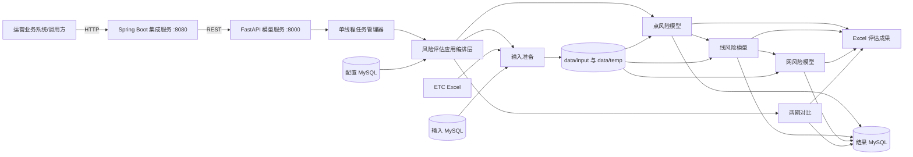
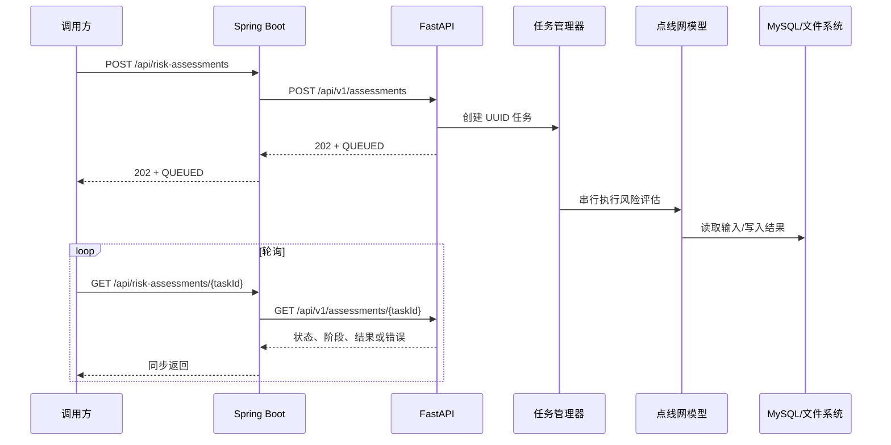
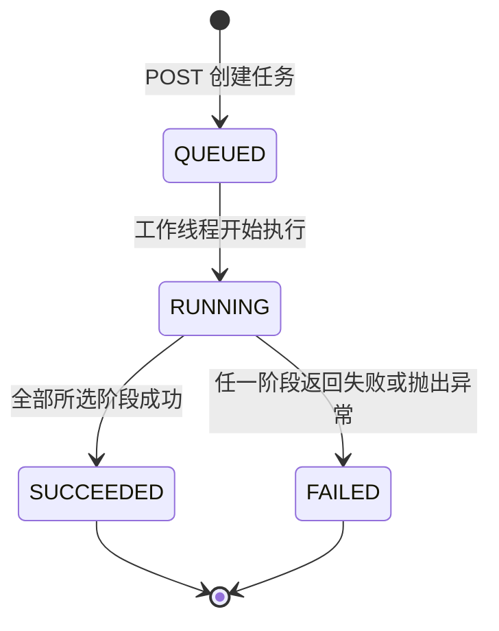

# 重庆山区高速公路路网安全运营综合评价系统技术文档

> 文档版本：1.0  
> 适用代码：模型核心 2.0.0、FastAPI 接口 3.0.0、Java 集成服务 1.0.0  
> 核对日期：2026-08-11  
> 适用对象：后端开发、算法开发、测试与部署运维人员

## 1. 项目概述

本项目面向重庆山区高速公路安全运营场景，将结构物状态、ETC 交通流、气象预警、交通事故、道路属性与路网拓扑等多源数据统一接入，按照“点—线—网”三级体系计算通行风险，并支持双月周期结果对比。

当前程序已形成四种使用与交付方式：

- Python 命令行直接执行完整评估流程；
- FastAPI 将评估流程封装为异步 RESTful API；
- Spring Boot 作为业务系统集成层，通过 HTTP 调用 Python 模型服务；
- Docker Compose 统一编排 Python 模型服务与 Java 集成服务。

核心设计原则是保留原有模型计算代码，通过应用编排层提供稳定调用边界。业务系统无需了解 Excel、MySQL 和各级模型内部步骤，只需提交任务并轮询任务状态。

## 2. 技术栈

| 层次 | 技术与版本 | 用途 |
| --- | --- | --- |
| 模型与数据处理 | Python 3.12、Pandas、NumPy、OpenPyXL、python-calamine | 多源数据清洗、Excel 读写和风险计算 |
| 数据库 | MySQL、PyMySQL | 输入数据读取、配置同步和评估结果持久化 |
| 模型服务 | FastAPI 0.115+、Pydantic 2.7+、Uvicorn | 参数校验、异步任务提交与状态查询 |
| 业务集成 | Java 17、Spring Boot 3.4.4、RestClient、Actuator | 对接 Python 模型并向业务系统暴露接口 |
| 工程与部署 | Docker、Docker Compose、Maven、Git | 构建、交付、服务编排和版本管理 |
| 测试 | unittest、Spring Boot Test、MockRestServiceServer | Python 接口/任务测试及 Java HTTP 适配测试 |

Python 依赖的准确范围以 [`requirements.txt`](requirements.txt) 为准，Java 依赖以 [`java-service/pom.xml`](java-service/pom.xml) 为准。

## 4. 总体架构



各层职责如下：

- Spring Boot 集成层：稳定业务接口、请求转发、超时控制和异常转换。
- FastAPI 接口层：请求校验、任务生命周期管理和结果元数据返回。
- 应用编排层：复用命令行已有步骤，决定是否准备输入、同步配置、重新计算和执行对比。
- 模型层：完成点、线、网风险计算，不依赖 HTTP 协议。
- 数据层：以 Excel 作为批处理输入/中间成果，以 MySQL 作为源数据、配置和结果存储。

## 5. 项目目录

```text
Highway_Risk_Assessment/
├── main.py                         # Python 命令行总控入口
├── requirements.txt               # Python 依赖
├── Dockerfile                     # Python 模型服务镜像
├── compose.yml                    # Python + Java 服务编排
├── .env.example                   # 容器环境变量模板
├── config/
│   ├── point_risk.ini             # 点风险参数及文件路径
│   ├── line_risk.ini              # 线风险参数及映射
│   ├── net_risk.ini               # 路网参数、拓扑和阈值
│   ├── compare.ini                # 两期对比配置
│   ├── input_db.example.ini       # 输入数据库配置模板
│   └── output_db.example.ini      # 输出数据库配置模板
├── data/
│   ├── input/                     # 模型输入文件
│   ├── temp/                      # 中间计算文件
│   └── output/                    # 最终 Excel 成果
├── src/
│   ├── input/                     # ETC 合并、MySQL 输入数据导出
│   ├── config_update/             # 配置库同步
│   ├── point_risk/                # 点风险模型
│   ├── line_risk/                 # 线风险模型
│   ├── net_risk/                  # 网风险模型
│   ├── compare/                   # 两期结果对比
│   ├── application/               # 可复用评估任务编排
│   ├── api/                       # FastAPI 与内存任务管理
│   └── log_create/                # 日志管理
├── java-service/                  # Spring Boot 集成服务
└── tests/                         # Python 自动化测试
```

## 6. 核心业务流程

### 6.1 完整执行链路



应用编排器按请求参数执行以下阶段：

1. `CONFIG_UPDATE`：可选，从配置库更新 INI 文件。
2. `INPUT_PREPARATION`：可选，合并 ETC 数据并导出 MySQL 输入数据。
3. `RISK_ASSESSMENT`：可选，依次执行点、线、网评估，并在阶段间复制依赖文件。
4. `PERIOD_COMPARISON`：可选，执行两期结果对比。
5. `COLLECTING_ARTIFACTS`：收集本次任务新建或更新的成果文件。
6. `COMPLETED` 或 `FAILED`：任务结束状态。

### 6.2 输入数据准备

输入模块主要完成两类工作：

- 将挂载目录中的 ETC 原始 Excel 合并为 `data/input/traffic_data/双月门架数据全量合并.csv`；
- 根据评估归属日期生成双月表后缀，从输入 MySQL 读取气象点预警、区域气象预警和交通事故数据，分别导出为 JSON 或 Excel。

评估周期通过 `RISK_BELONG_DATE` 或 `output_db.ini` 的 `[DATES] belong_date` 指定。起始日期等于归属日期，结束日期为下一个月的最后一天。例如归属日期为 `2025-12-01` 时，评估区间截至 `2026-01-31`。

输入库动态表名采用双月后缀，例如 `25_12_26_1`，对应表包括：

- `point_alert_<后缀>`：点位气象预警，输出至 `data/input/weather_warnings/*.json`；
- `district_alert_<后缀>`：区域气象预警，输出为 `data/input/气象预警.xlsx`；
- `accident_<后缀>`：交通事故，输出为 `data/input/交通事故.xlsx`。

### 6.3 点风险评估

点风险评估以桥梁、隧道、边坡等结构物为评价对象，主要步骤为：

1. 读取结构物基础信息并清洗技术状况等级、方向、桩号及所属路段。
2. 将技术状况等级映射为基础风险值：一级 83、二级 72、三级 55、四级 48。
3. 统计结构物 5 km 范围内的气象预警天数，并按 0 天、1～10 天、11～20 天、20 天以上使用 1.00、1.05、1.08、1.12 的动态系数。
4. 基于门架交通流计算拥堵度、大型车比例和速度离散等风险指标。
5. 汇总基础风险与动态风险，并应用 0.98 的专项管控折减系数。
6. 按总风险值划分低风险、一般风险、较高风险和高风险，并生成风险归因。

核心计算关系为：

```text
点总风险值 = 基础风险值 × 动态风险叠加系数 × 专项管控折减系数
```

最终结果写入：

- Excel：`data/output/全结构点通行风险值评价表.xlsx`；
- MySQL：`point_alert_statistic`、`point_etc_traffic_evaluation`、`point_risk_evaluation`。

### 6.4 线风险评估

线风险评估以道路区段和方向为评价单元，组合三个维度：

- 基础风险：结构物风险、冰雪/大雾易发属性、线形等静态因素；
- 动态风险：ETC 交通运行状态和气象预警；
- 附加风险：交通事故以及特殊道路属性。

主要处理过程包括路名和方向标准化、点风险向路段聚合、峰值交通状态计算、气象与事故匹配、风险系数计算和等级判定。配置中的等级阈值默认为 `100, 80, 60`，对应一级至四级。原始总分超过 100 时，程序将整数部分压缩为 99 并保留原小数部分，使结果保持在 100 以下。

结果写入：

- Excel：`data/output/路段通行风险评价总表.xlsx`；
- MySQL：`line_risk_evaluation`。

### 6.5 网风险评估

网风险以运营公司或示范路网为评价对象，基础风险由路段风险、连通性和路网密度三个指标组合：

```text
R = 路段风险加权结果
C = 100 × (1 - C′ / 2)
B = (参考密度 - 实际密度) / 参考密度 × 100
```

其中参考密度默认值为 `5.12`。程序将 `R、C、B` 从高到低转化为三个递减贡献项：

```text
F1 = max(R, C, B)
F2 = (100 - F1) × 第二大指标 / 100
F3 = (100 - F1 - F2) × 第三大指标 / 100
```

动态调节系数由路网平均饱和度和交通流均衡性共同确定。均衡性指标使用：

```text
E = 1 - 标准差 / 平均饱和度
动态调节系数 = 饱和度调节系数 × 均衡性调节系数
```

附加风险修正系数由事件 30 分钟到达率与 1 小时恢复通行率共同确定。最终计算结果包含基础风险、动态系数、附加系数、路网通行风险值、风险等级与风险归因。

结果写入：

- Excel：`data/output/路网通行风险评估结果_<时间戳>.xlsx`；
- MySQL：`net_risk_evaluation`。

### 6.6 两期风险对比

对比模块从结果库读取相邻周期的点、线、网评价数据，统一形成风险变化结果。当前重点识别规则包括：

- 风险上升：前后风险均在 70～80 区间且本期上升；
- 本期高风险：上期低于 80、本期达到或超过 80；
- 持续高风险：前后两期均达到或超过 90；
- 其他情况：不标记为特殊关注类型。

结果写入：

- Excel：`data/output/风险评价对比结果.xlsx`；
- MySQL：`risk_contrast`。

## 7. FastAPI 接口文档

服务默认地址为 `http://localhost:8000`。启动后可访问 Swagger UI：`http://localhost:8000/docs`，OpenAPI 描述：`http://localhost:8000/openapi.json`。

### 7.1 健康检查

```http
GET /health
```

响应示例：

```json
{
  "status": "UP",
  "busy": false
}
```

`busy=true` 表示至少存在一个排队或运行中的评估任务，但服务仍可接收新任务；新任务会进入串行队列。

### 7.2 创建评估任务

```http
POST /api/v1/assessments
Content-Type: application/json
```

请求字段：

| 字段 | 类型 | 默认值 | 说明 |
| --- | --- | --- | --- |
| `prepare_input` | boolean | `true` | 是否执行 ETC 合并和 MySQL 输入数据导出 |
| `update_config` | boolean | `false` | 是否先从配置数据库同步 INI 配置 |
| `compare` | boolean | `false` | 是否在评估后执行两期对比 |
| `recalculate` | boolean | `true` | 是否重新执行点、线、网评估 |

请求示例：

```json
{
  "prepare_input": true,
  "update_config": false,
  "compare": true,
  "recalculate": true
}
```

成功响应状态为 `202 Accepted`：

```json
{
  "task_id": "96d57f10-763b-4d3f-9918-7e25e20d91f6",
  "status": "QUEUED",
  "phase": "QUEUED",
  "created_at": "2026-08-11T03:00:00+00:00",
  "started_at": null,
  "finished_at": null,
  "result": null,
  "error": null
}
```

校验规则：

- 不允许请求体包含未定义字段；
- `recalculate=false` 时必须同时设置 `compare=true`；
- 参数校验失败返回 `422 Unprocessable Entity`。

仅使用已有数据库结果执行对比的请求示例：

```json
{
  "prepare_input": false,
  "update_config": false,
  "compare": true,
  "recalculate": false
}
```

### 7.3 查询任务状态

```http
GET /api/v1/assessments/{task_id}
```

成功结果示例：

```json
{
  "task_id": "96d57f10-763b-4d3f-9918-7e25e20d91f6",
  "status": "SUCCEEDED",
  "phase": "COMPLETED",
  "created_at": "2026-08-11T03:00:00+00:00",
  "started_at": "2026-08-11T03:00:01+00:00",
  "finished_at": "2026-08-11T03:20:01+00:00",
  "result": {
    "elapsed_seconds": 1200.125,
    "artifacts": [
      {
        "kind": "POINT_RISK",
        "path": "data/output/全结构点通行风险值评价表.xlsx",
        "size_bytes": 102400,
        "modified_at": "2026-08-11T03:08:00+00:00"
      }
    ]
  },
  "error": null
}
```

失败任务的 `status` 为 `FAILED`、`phase` 为 `FAILED`，错误摘要写入 `error`。查询不存在的任务返回 `404 Not Found`。

### 7.4 任务状态机



任务阶段与任务状态是两个字段：`status` 表示生命周期，`phase` 表示当前具体步骤。历史记录最多保存 100 条；达到上限时优先删除最早完成的任务。

## 8. Spring Boot 集成说明

Java 集成服务默认监听 `8080`，向业务系统暴露：

| 方法 | Java 接口 | 转发目标 |
| --- | --- | --- |
| POST | `/api/risk-assessments` | `POST /api/v1/assessments` |
| GET | `/api/risk-assessments/{taskId}` | `GET /api/v1/assessments/{task_id}` |
| GET | `/actuator/health` | Java 服务自身健康检查 |

调用路径采用 Controller → Service → `RiskAssessmentClient` 接口 → `FastApiRiskAssessmentClient` 实现。该结构隔离了业务层与具体 HTTP 客户端，便于替换实现或进行单元测试。

Java 服务配置：

| 环境变量 | 默认值 | 说明 |
| --- | --- | --- |
| `SERVER_PORT` | `8080` | Java 服务端口 |
| `RISK_API_BASE_URL` | `http://localhost:8000` | Python 模型服务地址 |
| `RISK_API_CONNECT_TIMEOUT` | `5s` | 建立连接超时 |
| `RISK_API_READ_TIMEOUT` | `30s` | 单次 HTTP 响应读取超时 |

由于模型采用异步任务，提交接口只等待任务创建，不等待模型计算完成。轮询状态接口也只读取内存状态，因此 30 秒读取超时不等于模型只能运行 30 秒。

Java 的 JDK HTTP 客户端固定使用 HTTP/1.1，避免默认的明文 HTTP/2（h2c）升级请求与 Uvicorn 组合时出现 JSON 请求体被解析为空的问题。

Java 异常映射规则：

- 非法业务参数映射为 HTTP 400；
- Python 返回 404 时 Java 同样返回 404；
- Python 其他 HTTP 错误或服务不可达时返回 502。

## 9. 配置管理

### 9.1 INI 配置

| 文件 | 主要内容 |
| --- | --- |
| `config/point_risk.ini` | 点风险输入输出路径、基础分值、天气半径及交通风险参数 |
| `config/line_risk.ini` | 线风险路径、静态/动态/附加风险参数、道路与方向映射 |
| `config/net_risk.ini` | 道路长度、设计通行能力、所属公司、路网拓扑及风险阈值 |
| `config/compare.ini` | 对比周期、字段映射与输出设置 |
| `config/input_db.ini` | 原始输入数据库连接及数据表配置 |
| `config/output_db.ini` | 结果数据库、结果表名和评估归属日期 |

`input_db.ini` 和 `output_db.ini` 包含敏感连接信息，已通过 `.gitignore` 排除。首次部署应从对应的 `*.example.ini` 复制生成，不应将真实密码提交到版本库。

### 9.2 环境变量覆盖

容器部署建议使用环境变量覆盖数据库连接。可用变量如下：

| 类别 | 环境变量 |
| --- | --- |
| 评估周期 | `RISK_BELONG_DATE` |
| 输入数据库 | `RISK_INPUT_DB_HOST`、`RISK_INPUT_DB_PORT`、`RISK_INPUT_DB_USER`、`RISK_INPUT_DB_PASSWORD`、`RISK_INPUT_DB_NAME` |
| 输出数据库 | `RISK_OUTPUT_DB_ENABLE`、`RISK_OUTPUT_DB_AUTO_CREATE`、`RISK_OUTPUT_DB_HOST`、`RISK_OUTPUT_DB_PORT`、`RISK_OUTPUT_DB_USER`、`RISK_OUTPUT_DB_PASSWORD`、`RISK_OUTPUT_DB_NAME` |
| 配置数据库 | `RISK_CONFIG_DB_HOST`、`RISK_CONFIG_DB_PORT`、`RISK_CONFIG_DB_USER`、`RISK_CONFIG_DB_PASSWORD` |
| ETC 挂载目录 | `ETC_DATA_DIR` |

当容器通过 `./config:/app/config` 挂载宿主机配置目录时，镜像内创建的配置文件会被挂载目录覆盖，因此宿主机 `config/` 中必须存在完整的模型 INI 文件。环境变量为空时，程序回退到 INI 配置。

## 10. 启动与调用

### 10.1 本地运行 Python 命令行

```bash
python3 -m venv .venv
source .venv/bin/activate
pip install -r requirements.txt
cp config/input_db.example.ini config/input_db.ini
cp config/output_db.example.ini config/output_db.ini
python main.py
```

常用命令：

```bash
python main.py --config-update
python main.py --compare
python main.py --compare --no-recalculate --no-input
python main.py --no-input
python main.py --simple-log
```

### 10.2 本地启动 FastAPI

```bash
uvicorn src.api.app:app --host 0.0.0.0 --port 8000 --workers 1
```

### 10.3 本地启动 Spring Boot

先启动 FastAPI，再执行：

```bash
cd java-service
mvn spring-boot:run
```

或打包后运行：

```bash
mvn clean package
java -jar target/risk-integration-service-1.0.0.jar
```
调用示例：

```bash
curl -X POST "http://localhost:8080/api/risk-assessments" \
    -H "Content-Type: application/json" \
    -d '{
      "prepare_input": true,
      "update_config": false,
      "compare": true,
      "recalculate": true
    }'

curl "http://localhost:8080/api/risk-assessments/<task_id>"
```

### 10.4 Docker Compose 部署

```bash
cp .env.example .env
# 修改 .env 中的日期、数据库地址、账号和密码
docker compose up -d --build
docker compose ps
```

默认端口：

- Python FastAPI：`8000`；
- Java Spring Boot：`8080`。

Compose 将 `config/`、`data/` 和 `log/` 挂载到 Python 容器，并将 ETC 目录只读挂载到 `/ETC_Data`。当 MySQL 位于宿主机时，示例使用 `host.docker.internal` 访问宿主机数据库。

## 11. 数据与成果文件

| 类型 | 路径/对象 | 说明 |
| --- | --- | --- |
| ETC 合并数据 | `data/input/traffic_data/双月门架数据全量合并.csv` | 双月门架原始数据合并结果 |
| 气象数据 | `data/input/weather_warnings/*.json`、`data/input/气象预警.xlsx` | 点位和区域预警 |
| 事故数据 | `data/input/交通事故.xlsx` | 双月交通事故数据 |
| 点风险成果 | `data/output/全结构点通行风险值评价表.xlsx` | 结构点评价结果 |
| 线风险成果 | `data/output/路段通行风险评价总表.xlsx` | 路段评价结果 |
| 网风险成果 | `data/output/路网通行风险评估结果_<时间戳>.xlsx` | 公司/路网评价结果 |
| 对比成果 | `data/output/风险评价对比结果.xlsx` | 两期风险变化结果 |
| 日志 | `log/` | 命令行及模型执行日志 |

FastAPI 只返回本次任务启动后新建或更新的成果文件。固定文件名若仍是历史任务产物，不会被错误地加入本次任务响应。

## 12. 日志、错误与运维观察

- Python 总控在每一阶段返回布尔结果；任一选中阶段失败，应用编排层将任务标记为 `FAILED`。
- 模型阶段异常由总控捕获并记录堆栈，API 响应的 `error` 保存阶段级错误摘要。
- `/health` 用于判断 Python 进程是否存活以及队列是否繁忙，不检查 MySQL 连通性和模型输入文件完整性。
- `/actuator/health` 用于判断 Java 进程状态，不代表 Python 服务和数据库一定可用。
- Docker Compose 仅对 Python `/health` 配置健康检查；Java 服务在 Python 健康后启动。
- 建议生产环境同时监控容器状态、接口健康、任务失败率、任务耗时、磁盘空间和 MySQL 写入异常。

常见故障定位：

| 现象 | 优先检查 |
| --- | --- |
| 输入准备失败 | ETC 挂载路径、输入库连接、双月动态表是否存在、日期后缀是否正确 |
| 点风险失败 | 结构物文件、门架文件、气象 JSON、列名和 `point_risk.ini` 路径 |
| 线风险失败 | 点风险成果是否已复制到 `data/input`、道路名称映射、评价模板 |
| 网风险失败 | 线风险成果、路网拓扑、道路长度/设计流量和事故数据 |
| Java 返回 502 | FastAPI 地址、容器网络、连接/读取超时和 Python 原始响应 |
| 任务查询 404 | task_id 错误，或 Python 服务重启导致内存任务历史丢失 |
| 任务一直 QUEUED | 前序任务仍运行；当前设计只允许一个任务执行 |

## 13. 测试与验证

### 13.1 Python 测试

```bash
python3 -m unittest discover -s tests/api_tests -p 'test_*.py'
python3 -m unittest discover -s tests/net_tests -p 'test_*.py'
```

API 测试覆盖请求默认值、非法参数、任务创建、状态查询、未知任务 404、串行执行和失败状态；路网测试覆盖关键配置解析与校验。

### 13.2 Java 测试

```bash
cd java-service
mvn test
```

Java 测试覆盖 Service 委托行为，以及 RestClient 的请求路径、JSON 序列化和响应反序列化。
